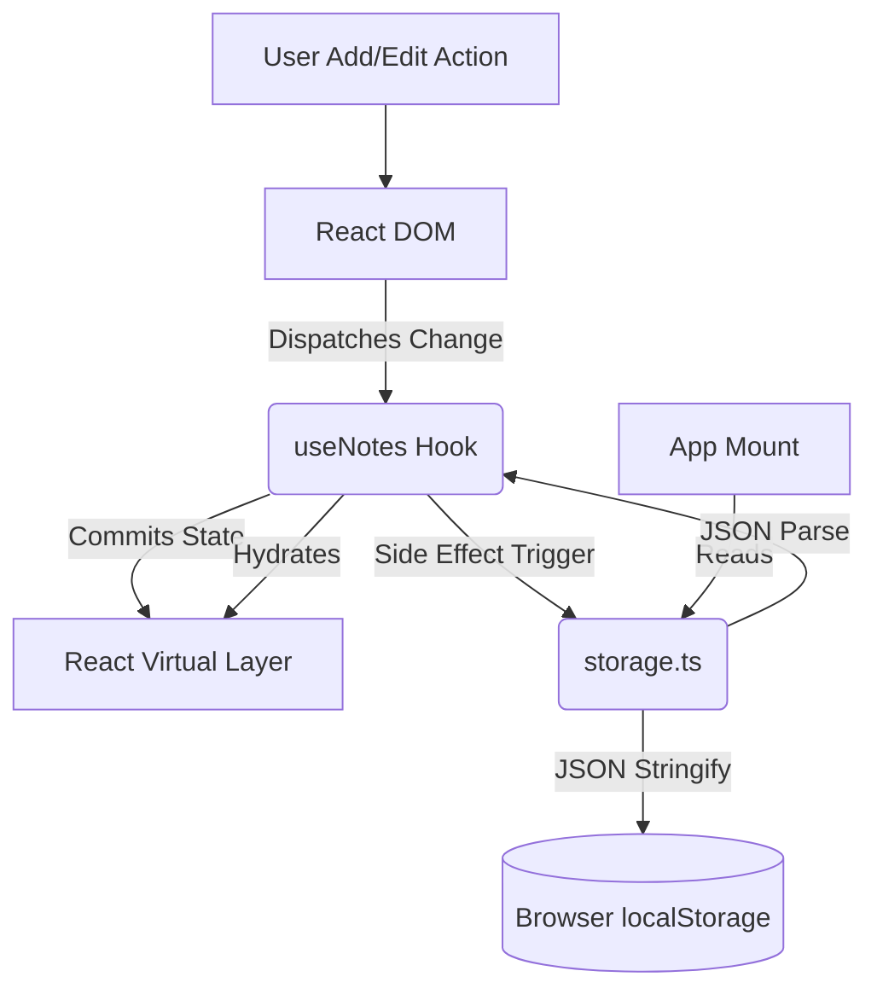
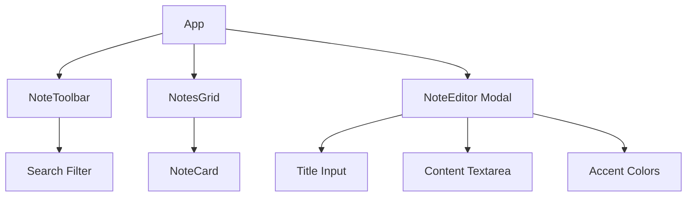

# System Architecture: Notes App

## 1. High-Level Overview
The SyntecXhub Notes application implements an entirely local, persistence-first architecture. Instead of relying on a network connection, the state is tightly coupled to the browser's `localStorage` HTML5 API. The UI scales efficiently using CSS column features for a masonry format.

## 2. Technology Stack
- **Core:** React 19, TypeScript 5.7
- **Bundler:** Vite 6.0
- **Styling:** Tailwind CSS v4 (Masonry & Modals)
- **Data Persistence:** DOM Web Storage API (localStorage)

## 3. Persistent State Flow



## 4. Component Hierarchy


## 5. File Structure
```text
/src
 ├── /components              # Distinct functional boundaries
 │   ├── NoteCard.tsx         # Hover states, pin options
 │   ├── NoteEditor.tsx       # Intercepting modal logic
 │   ├── NotesGrid.tsx        # Masonry column generation
 │   └── NoteToolbar.tsx      # Entry and global search
 ├── /hooks
 │   └── useNotes.ts          # State array management & filters
 ├── /utils
 │   └── storage.ts           # Try/Catch wrapper for localStorage
 ├── /types
 │   └── note.types.ts        # Interfaces and Color Enums
 ├── App.tsx                  # Global orchestration layer
 ├── index.css                # CSS Columns and Theme Colors
 └── main.tsx                 # Bootstrapper
```

---
**Developer:** LSR Vidanaarachchi<br>
**Portfolio:** [lakidev.me](https://lakidev.me/)<br>
**GitHub:** [lakipop](https://github.com/lakipop)<br>

*Developed for the SyntecXhub Internship Program*